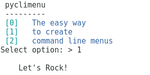

# pyclimenu


This python module creates simple command line menus. Just define the callable and the label of each option and voila!
Foreground, background color numbering and labels are adjustable.

## Install
```bash
pip install git+https://github.com/sp1thas/pyclimenu.git
```

## Demo
```python
from pyclimenu.menu import Menu

def a():
    print('''
    Let's Rock!
    ''')
    return 1

mn = Menu()
mn.add_item(label='The easy way', clb=a, args=())
mn.add_item(label='to create', clb=a, kwargs={})
mn.add_item(label='command line menus', clb=a)
mn.set_colors(num_fg='cyan', num_bld=True, label_fg='blue', label_bld=True)

results = mn.run(header='pyclimenu')
print(results)
```


## Todo
